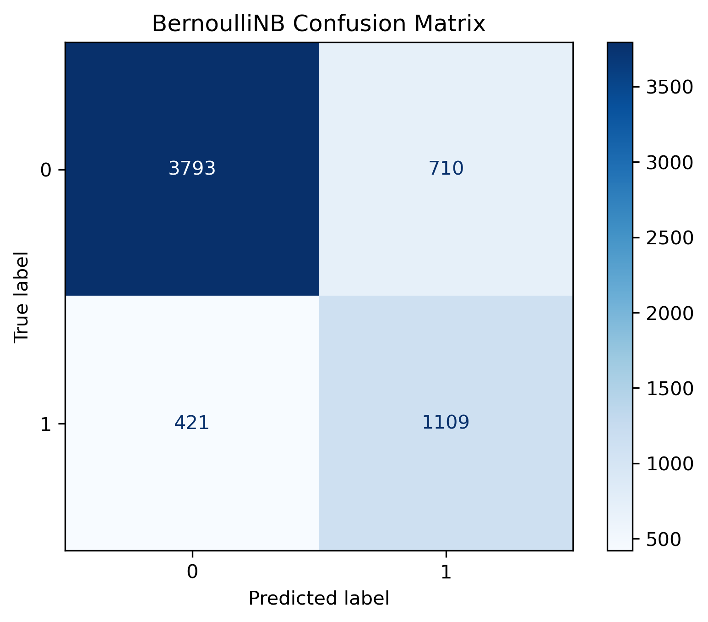
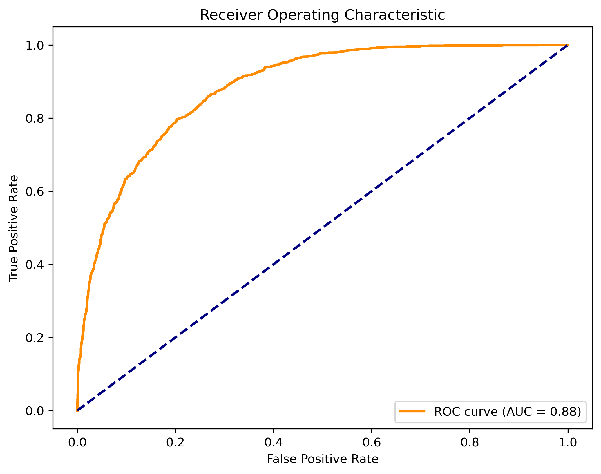

The **Adult Income dataset** is a collection of 1994 U.S. Census records used to predict whether an individual earns more than $50,000 per year. This project addresses a **binary classification problem** using 14 demographic features, including a mix of continuous numerical data (e.g., age, hours-per-week) and categorical data (e.g., education, occupation).

The dataset was sourced from the [UCI Machine Learning Repository](https://archive.ics.uci.edu/dataset/2/adult).

Dataset Size: 32,561 observations | 14 demographic features

### Research Question
> To what extent can **K-Nearest Neighbors (KNN)** and **Naive Bayes** classifiers accurately predict an individual’s income level (above or below $50,000) using 1994 Census data, and how do their underlying mathematical assumptions handle high-dimensional, skewed feature sets?

## Key Results & Findings
* **Model Performance:** Both KNN (k=5) and Bernoulli Naive Bayes achieved a baseline accuracy of **81.3%** on the unseen test set.
* **Algorithm Failure Analysis:** The Gaussian Naive Bayes model underperformed significantly (45.02%). This highlighted the critical importance of matching an algorithm’s mathematical assumptions (normality) to the actual distribution of the data.
* **Production Readiness:** While KNN is effective, the implementation of **Ensemble Methods (Random Forest)** is proposed for future iterations to better handle the skewed distributions that challenged the simpler probabilistic models.

## Model Evaluation
### Confusion Matrix (BernoulliNB)

*The confusion matrix demonstrates the model's ability to balance True Positives and True Negatives, crucial for identifying high-income earners in a skewed dataset.*

### ROC/AUC Curve

*By plotting the True Positive Rate against the False Positive Rate, we confirmed a robust AUC score, validating the model's discriminative power.*

## Technical Methodology
* **Preprocessing:** Feature scaling via StandardScaler and handling categorical variables.
* **Math Logic:** Leveraged BernoulliNB to better handle the binary-heavy feature space of the Census dataset.

## Future Work
To further improve predictive power, I plan to implement **Ensemble Methods** like Random Forest, which are natively robust against the skewed distributions found in this data.
